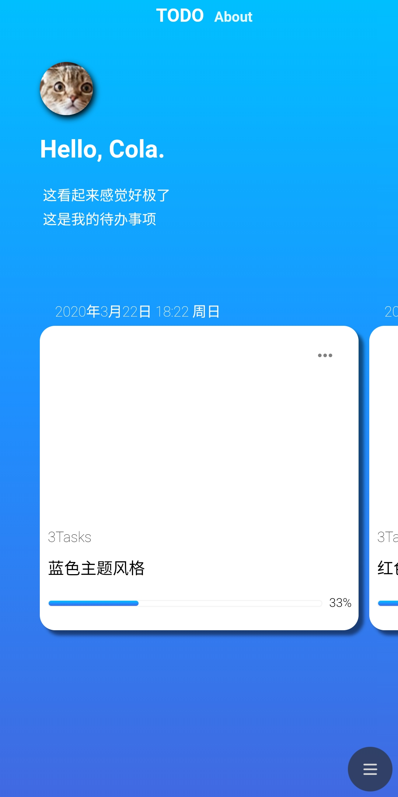
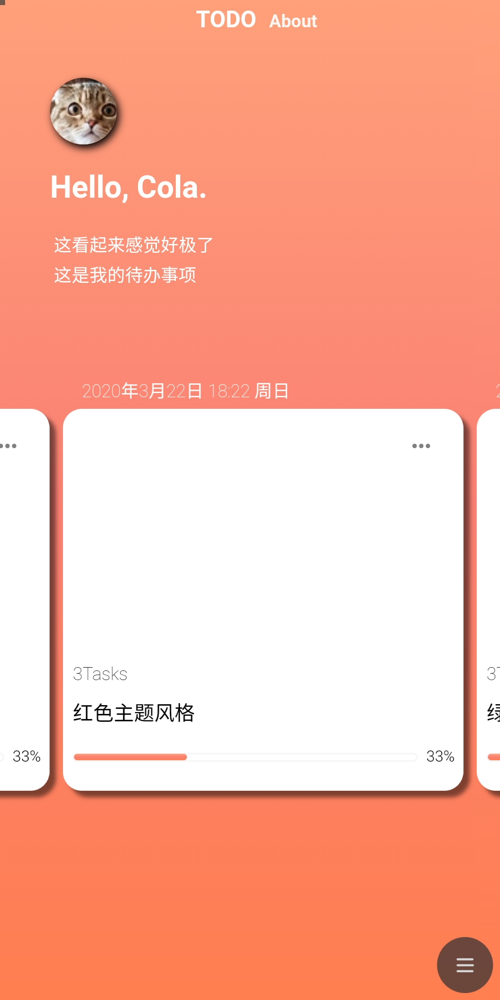
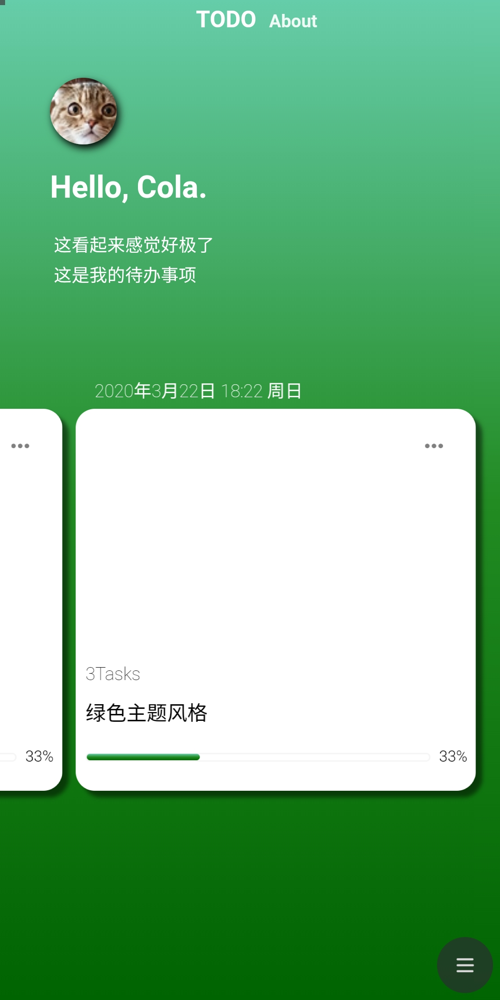

## 一个用Vue做的比较漂亮的Todo

**这个是移动端的哦，请用移动设备打开**

先看看效果图吧

#### 蓝宝石主题风格

#### 烈日灼心主题风格

#### 深邃翡翠主题风格

## 技能

- Vue
- Vuex
- VueRouter
- Express
- Animate.css
- Less

其实做的很不理想，与一开始期望的差的比较远，不过还是有所长进。

一开始，我想了很多，有很多idea，但因为很久没写过前端了，刚从PHP转过来，基础忘了很多，所以在写的过程感觉到自己知识不够笃实，实现起来不太好，所以**阉割了许多**，包括一开始计算的后端。

> 我之所以看得远,是因为我站在巨人的肩膀上	—— 牛顿

